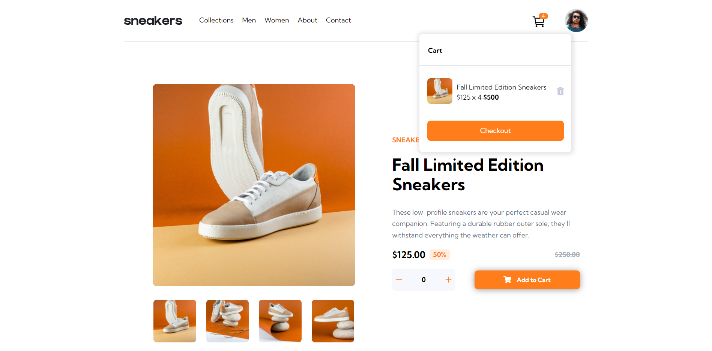

# Frontend Mentor - E-commerce product page solution

This is a solution to the [E-commerce product page challenge on Frontend Mentor](https://www.frontendmentor.io/challenges/ecommerce-product-page-UPsZ9MJp6). Frontend Mentor challenges help you improve your coding skills by building realistic projects.

## Overview

### Screenshot

## My process

### Built with

- Semantic HTML5 markup
- CSS custom properties
- Flexbox
- [SASS](https://sass-lang.com/) - SASS Pré processor

- Website: [https://ecommerce-basic-page.netlify.app/](https://ecommerce-basic-page.netlify.app/)

## Author

Developed by Alex Maia 🚀